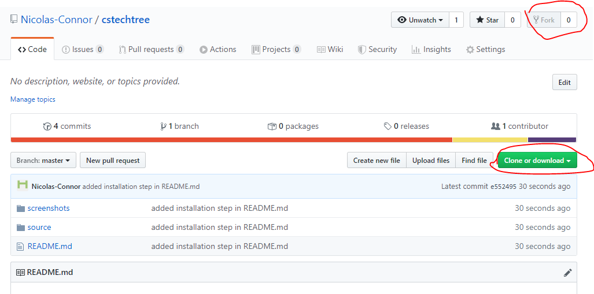
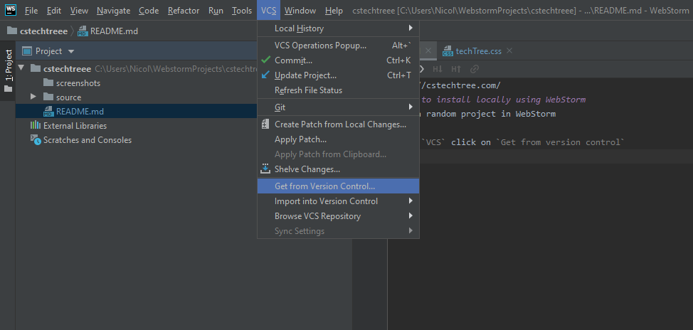
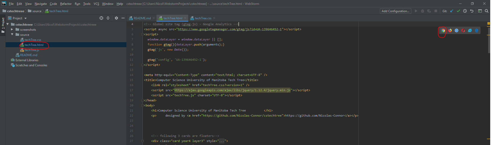

http://cstechtree.com/
# How to install locally using WebStorm
Fork CSTech tree

In GitHub within your new "fork" of this project click on `Clone or download` and copy the URL that pops out

Open a random project in WebStorm

Under `VCS` click on `Get from version control`

Paste in the URL you copied from step 2 and click `clone`

You should now have the project files of CSTechTree locally on your machine

To open the project in your browser, first open the `techTree.html` file then in the top right of the file page 
click on your favorite browser.  The project should now open in your browser.

